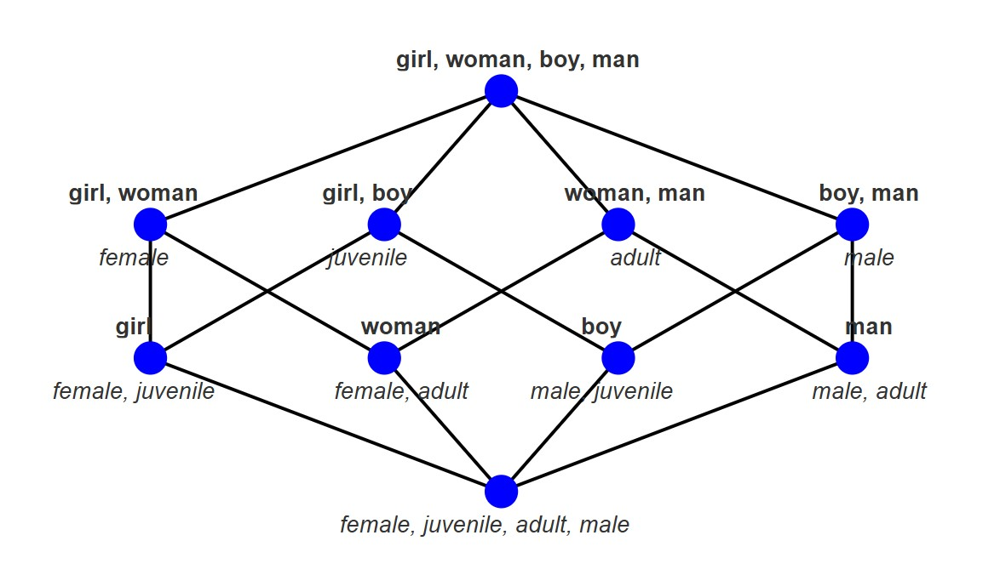

# 🛠️**Examples**

This page showcases a set of example visualizations and use cases using `lattice.js`. These examples demonstrate different labeling modes, filtering, and layout strategies supported by the library.

## 🔹 Example 1: Basic Lattice gender-age example

|        | Female | Juvenile | Adult | Male |
|--------|--------|----------|--------|------|
| Girl   | x      | x        |        |      |
| Woman  | x      |          | x      |      |
| Boy    |        | x        |        | x    |
| Man    |        |          | x      | x    |

Below are two concept lattices derived from the same formal context. The left shows default labeling, and the right shows reduced labeling.

| Default Labeling | Reduced Labeling |
|------------------|------------------|
|  | |

