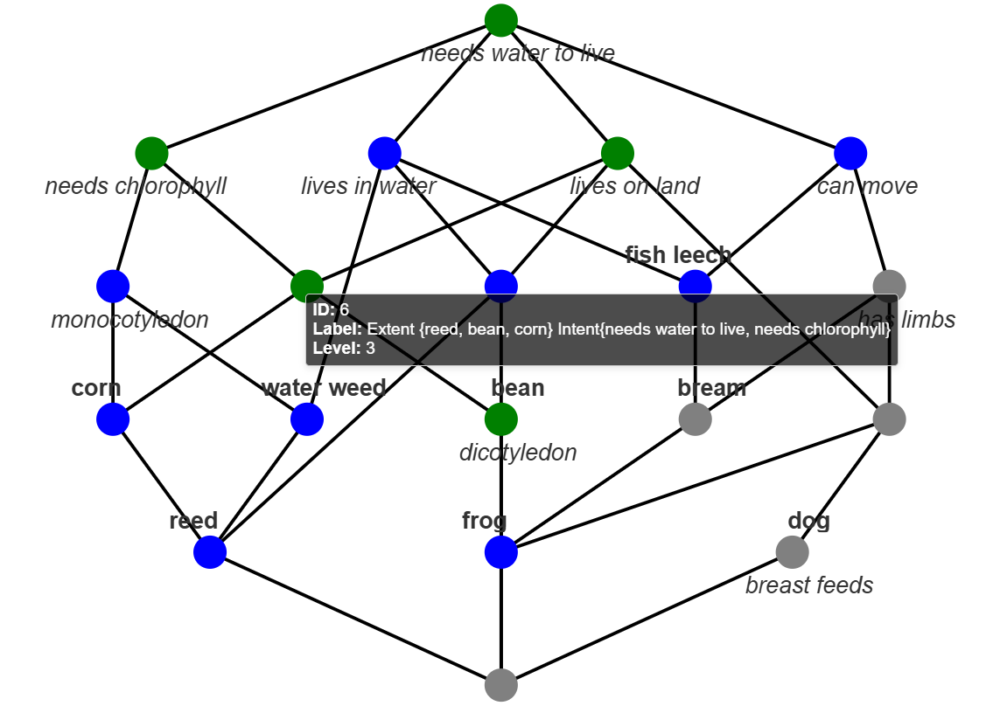

# 🛠️**Examples**

This page showcases a set of example visualizations and use cases using `lattice.js`. These examples demonstrate different labeling modes, filtering, and layout strategies supported by the library.

## 🔹 Example 1: Basic Lattice gender-age example

|        | Female | Juvenile | Adult | Male |
|--------|--------|----------|--------|------|
| Girl   | x      | x        |        |      |
| Woman  | x      |          | x      |      |
| Boy    |        | x        |        | x    |
| Man    |        |          | x      | x    |

Below are two concept lattices derived from the same formal context. The left shows full labeling, and the right shows reduced labeling. 

| Full Labeling | Reduced Labeling |
|------------------|------------------|
|  | |

## 🔹 Example 2: Building Regulations

|       | roof | stairs | stairwell | windows | chimney | cellar floor | fire door | foundation | front door |
|-------|------|--------|-----------|---------|---------|------------------|--------------|------------|----------------|
| §15   | x    | x      | x         | x       | x       | x                |              | x          |                |
| §16   | x    |        |           |         | x       |                  |              |            |                |
| §17   | x    | x      | x         |         | x       |                  | x            |            |                |
| §18.1 | x    |        | x         | x       | x       | x                |              |            |                |
| §18.2 | x    | x      | x         | x       |         |                  |              |            | x              |
| §31   | x    |        |           |         |         |                  |              |            | x              |
| §32   |      | x      | x         | x       |         |                  |              |            |                |
| §33   |      | x      |           |         |         |                  |              |            |                |
| §36   |      |        |           | x       |         |                  |              |            |                |

The following visualizations are based on a formal context of building regulations. On the left, we see the default concept lattice. On the right, the filtering feature is demonstrated for the object **§15** and the attribute **roof**, highlighting relevant concepts. A tooltip is also shown for demonstration purposes.

In this view, nodes are color-coded based on filtering results:
- 🟠 **Orange**: match in both extent and intent  
- 🟢 **Green**: match in extent only  
- ⚫ **Grey**: match in intent only

| Default Lattice | Filtered by **§15** and "roof" |
|------------------|-------------------------------|
|  | -tooltip.png) |

## 🔹 Example 3: Life in Water

The following formal context relates to biological traits of animals and plants, including movement, habitat, and reproduction.

|              | needs water to live | lives in water | lives on land | needs chlorophyll | dicotyledon | monocotyledon | can move | has limbs | breast feeds |
|--------------|----------------------|----------------|----------------|--------------------|-------------|----------------|-----------|------------|----------------|
| fish leech   | x                    | x              |                |                    |             |                | x         |            |                |
| bream        | x                    | x              |                |                    |             |                | x         |            |                |
| frog         | x                    | x              | x              |                    |             |                | x         | x          |                |
| dog          | x                    |                | x              |                    |             |                | x         | x          | x              |
| water weeds  | x                    | x              |                | x                  |             |                |           |            |                |
| reed         | x                    | x              |                | x                  |             | x              |           |            |                |
| bean         | x                    |                |                | x                  | x           |                |           |            |                |
| corn         | x                    |                |                | x                  |             | x              |           |            |                |

---

Below is the concept lattice computed from the formal context above. A single tooltip is shown for demonstration purposes.
In this view, nodes are color-coded based on filtering results:
- 🔵 **Blue**: concept does not match either filter criterion 
- 🟢 **Green**: match in extent only  
- ⚫ **Grey**: match in intent only

## 🔹 Example 4: Life in Water Parsed JSON Example from `concepts` Library

This example is taken directly from the [concepts Python library documentation](https://concepts.readthedocs.io/en/stable/examples.html#example-json), demonstrating a formal context for linguistic agreement features (person, number, polarity).

The following table shows the original binary relation between personal pronouns and their grammatical features:

|      | +1 | -1 | +2 | -2 | +3 | -3 | +sg | +pl | -sg | -pl |
|------|----|----|----|----|----|-----|-----|-----|-----|-----|
| 1sg  | x  |    |    |    |    | x   | x   |     | x   |     |
| 1pl  | x  |    |    |    |    | x   |     | x   |     | x   |
| 2sg  |    | x  | x  |    |    |     | x   |     | x   |     |
| 2pl  |    | x  | x  |    |    |     |     | x   |     | x   |
| 3sg  |    |    |    | x  | x  |     | x   |     | x   |     |
| 3pl  |    |    |    | x  | x  |     |     | x   |     | x   |

---
The following concept lattice was automatically generated using our `lattice.js` parser, successfully converting the original `concepts` JSON format into our internal structure:

---

✅ This confirms compatibility between `lattice.js` and external FCA tools like the `concepts` Python library.

